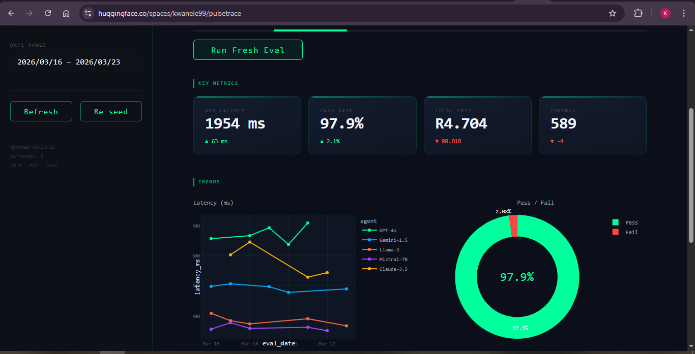

# ◉ PulseTrace — Free AI Agent Monitoring & Evaluation Dashboard

<p align="center">
  
  
  
  
  
  
</p>

<p align="center">
  <strong>Monitor, evaluate, and debug AI agents — completely free, no API keys required.</strong><br>
  OpenTelemetry-style traces · Real-time evaluation metrics · Agent health monitoring · Structured logs
</p>

<p align="center">
  <a href="https://kwanele99-pulsetrace.hf.space" target="_blank">
    
  </a>
</p>

---




---

## Features

| Tab | What you get |
|-----|-------------|
| **Live Traces** | OTel waterfall (Gantt) for the latest run · Interactive trace table · Expandable span details · **Simulate Agent Run** button |
| **Evaluations** | 4 metric cards (Latency, Pass Rate, Cost R, Token/s) · Latency trend · Cost over time · Pass/Fail donut · Token throughput by agent · **Run Fresh Eval** button |
| **Agent Health** | Status grid with colour-coded badges (Healthy / Degraded / Down) · Alert badges for high errors & latency · Uptime overview chart · Live countdown timer |
| **Logs & Export** | Filterable log table (level + keyword) · Colour-coded log levels · **Export CSV** + **Export JSON** download buttons |

**Sidebar:** Agent dropdown · Date range picker · Refresh + Re-seed buttons

---

## Deploy in 60 Seconds

### Local (recommended for development)

```bash
# 1. Install dependencies
pip install -r requirements.txt

# 2. Launch
streamlit run app.py
```

Open [http://localhost:8501](http://localhost:8501) — the dashboard seeds itself with realistic fake data on first run.

---

### HuggingFace Spaces (free hosting)

1. Create a new Space at [huggingface.co/new-space](https://huggingface.co/new-space)
2. Select **Docker** as the SDK
3. Push this repository to the Space
4. The app will be live at `https://huggingface.co/spaces/<your-username>/pulsetrace`

**Live instance:** [https://kwanele99-pulsetrace.hf.space](https://kwanele99-pulsetrace.hf.space)

> **Note:** HuggingFace Spaces free tier uses ephemeral storage — the SQLite database resets on each restart. The app auto-seeds itself every time, so this is seamless.

---

### Docker (local or any cloud)

```bash
# Build
docker build -t pulsetrace .

# Run
docker run -p 7860:7860 pulsetrace
```

Open [http://localhost:7860](http://localhost:7860)

---

### Streamlit Community Cloud (free)

1. Push to a public GitHub repository
2. Go to [share.streamlit.io](https://share.streamlit.io)
3. Connect your repo and set **Main file** to `app.py`
4. Deploy — live URL provided instantly

---

## Project Structure

```
pulsetrace/
├── app.py                  # Main Streamlit application (UI + tab renderers)
├── otel_tracer.py          # OpenTelemetry trace simulation engine
├── evals_db.py             # SQLite data layer (schema, seed, queries, export)
├── requirements.txt        # Python dependencies
├── Dockerfile              # HuggingFace Spaces optimised container
├── .streamlit/
│   └── config.toml         # Dark theme + server config (port 7860)
└── .gitignore
```

---

## Architecture

```
┌─────────────────────────────────────────────────────────┐
│                        app.py                           │
│   Sidebar · 4 Tabs · CSS Injection · Session State      │
└────────────────┬───────────────────┬────────────────────┘
                 │                   │
        ┌────────▼──────┐   ┌────────▼──────┐
        │ otel_tracer   │   │   evals_db    │
        │               │   │               │
        │ OTel SDK IDs  │   │ SQLite        │
        │ Span pipeline │──▶│ 4 tables      │
        │ Latency sim   │   │ Seed + Query  │
        │ ZAR costing   │   │ CSV/JSON out  │
        └───────────────┘   └───────────────┘
                                    │
                             pulsetrace.db
                           (auto-created at runtime)
```

---

## Data Schema

| Table | Purpose |
|-------|---------|
| `traces` | All OTel spans — one row per span, linked by `trace_id` |
| `evaluations` | Daily aggregated metrics per agent (pass rate, cost, latency) |
| `agents` | Health status, uptime %, error rate, last ping per agent |
| `logs` | Structured log entries with level, message, and trace reference |

---

## Simulated Agents

| Agent | Status | Profile |
|-------|--------|---------|
| GPT-4o | Healthy | ~1800ms avg · R0.09/1K in |
| Claude-3.5 | Healthy | ~1400ms avg · R0.055/1K in |
| Gemini-1.5 | Degraded | ~900ms avg · R0.0065/1K in |
| Llama-3 | Healthy | ~500ms avg · R0.0037/1K in |
| Mistral-7B | Down | ~320ms avg · R0.0019/1K in |

> All data is **100% simulated** — no real LLM API calls are made. Costs are in **South African Rand (ZAR)**.

---

## Configuration

Edit [.streamlit/config.toml](.streamlit/config.toml) to customise:

```toml
[theme]
primaryColor = "#00ff9d"     # Accent colour (neon green)
backgroundColor = "#0e1117"  # Page background
```

Change `DB_PATH` at the top of [app.py](app.py) and [evals_db.py](evals_db.py) to persist the database to a different location.

---

## Dependencies

| Package | Version | Purpose |
|---------|---------|---------|
| `streamlit` | >= 1.54 | UI framework |
| `plotly` | >= 5.24 | Interactive charts |
| `pandas` | >= 2.0 | Data manipulation |
| `faker` | >= 30.0 | Realistic fake log data |
| `opentelemetry-api` | >= 1.40 | OTel trace/span IDs |
| `opentelemetry-sdk` | >= 1.40 | InMemorySpanExporter |

`sqlite3` is Python stdlib — no installation needed.

---

## License

MIT — free to use, modify, and distribute.

---

<p align="center">
  Built with Streamlit · OpenTelemetry · Plotly · SQLite
</p>
